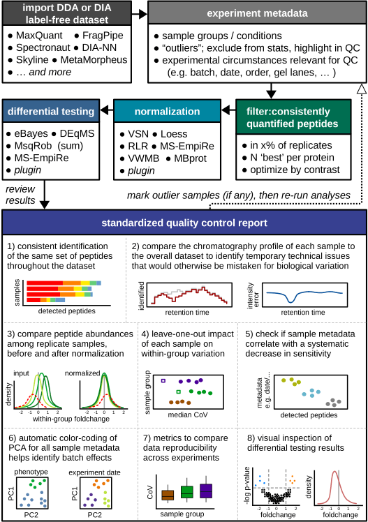
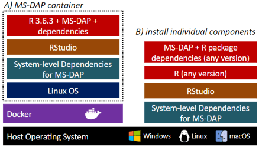

---
output:
  github_document:
    html_preview: true
    toc: false
---

<!-- README.md is generated from README.Rmd using devtools::build_readme() -->


<!--   -->


 &nbsp;

The Mass Spectrometry Downstream Analysis Pipeline (MS-DAP) is an open-source R package for analyzing and interpreting label-free proteomics datasets, and is compatible with various upstream raw-data-processing software (e.g. MaxQuant, DIA-NN, FragPipe, Spectronaut, etc). 
It provides a user-friendly interface for data processing steps such as feature selection (peptide filtering), normalization of quantitative values and differential expression analysis (DEA). 
Many commonly used normalization and DEA algorithms are integrated and users can provide custom functions (plugins) for normalization and DEA.
A comprehensive quality control report can be generated that provides extensive data visualizations for quality and reproducibility metrics, identification of potential batch-effects and interpretation of statistical results (this PDF includes documentation and information needed to reproduce results).

 &nbsp;

**Citation:**

_Koopmans, F., Li, K.W., Klaassen, R.V., Smit, A.B. (2022). MS-DAP platform for downstream data analysis of label-free proteomics uncovers optimal workflows in benchmark datasets and increased sensitivity in analysis of Alzheimer's biomarker. Journal of Proteome Research._ https://doi.org/10.1021/acs.jproteome.2c00513

 &nbsp;

## Overview



[This introduction to MS-DAP](doc/intro.md) provides a complete overview of main features and example data visualizations.


MS-DAP


## Quickstart

Installation of the R package in RStudio (assuming [R](https://cran.r-project.org), [RTools](https://cran.r-project.org/bin/windows/Rtools/history.html) and [RStudio](https://www.rstudio.com/products/rstudio/) have been installed).

On some systems, you may encounter errors when installing this R package from GitHub if Git is not installed. In this case; on MacOS, install [Homebrew](https://brew.sh) if you haven't then `$ brew install git`. On Windows, [download Git here](https://git-scm.com/download/win), install and reboot your computer.


```{r gh-installation, eval = FALSE}
install.packages(c("devtools", "tidyverse", "tinytex", "BiocManager"))
tinytex::install_tinytex()
# On Windows; say 'no' to optionally compile packages and during TinyTex installation you may see 2 popups; these can be dismissed
BiocManager::install(c('ProtGenerics', 'MSnbase', 'limma'), update=T, ask=F)
Sys.setenv(R_REMOTES_NO_ERRORS_FROM_WARNINGS="true")
devtools::install_github("ftwkoopmans/msdap", upgrade = "never") # don't update dependencies if not needed
```

to update an existing MS-DAP installation to the latest version (without updating other packages);
```{r gh-update, eval = FALSE}
Sys.setenv(R_REMOTES_NO_ERRORS_FROM_WARNINGS="true")
devtools::install_github("ftwkoopmans/msdap", upgrade = "never")
```


Example for analyzing a DIA dataset processed by DIA-NN (check the [user guide](doc/userguide.md) for replacing DIA-NN input with Spectronaut, MaxQuant, etc.)

```{r eval=FALSE}
library(msdap)
# set the working directory to the full path where your data is stored (optionally, skip and use full paths below)
# importantly, use forward slashes for the path (so not "C:\temp" but "C:/temp")
setwd("C:/path/to/myproject")                                           # <<EDIT THIS FILENAME>>

# 1) Load data files, output from upstream raw data processor and the exact same fasta file(s) used there
dataset = import_dataset_diann(filename = "diann_resulting_report.tsv") # <<EDIT THIS FILENAME>>
dataset = import_fasta(dataset, files = "proteome.fasta")               # <<EDIT THIS FILENAME>>

# 2) Create a template file that describes all samples. A new Excel table will be created at this path
# - note; you only have to do steps 2 and 3 once per dataset
write_template_for_sample_metadata(dataset, "sample_metadata.xlsx")

# 3) Time to step away from R for a sec, and edit this template file in Excel or LibreOffice;
# - describe the sample group of each sample in the "group" column
# - add additional columns with any metadata that varies between samples (measurement order, gel, gel lane, batch, etc.) -->> QC figures will be auto generated
# - further documentation is available in the "instructions" tab within the Excel file

# 4) Load sample metadata from file you just edited (don't forget to save it first)
dataset = import_sample_metadata(dataset, filename = "sample_metadata.xlsx")

# 5) Optionally, describe a statistical contrast; in this example we compare sample groups "WT" and "KO".
# - You should use exact same labels as "group" column in sample metadata table.
# - If you don't want to do stats, simply remove or comment this line (e.g. just look at QC report, or maybe your dataset has 1 experimental group only).
# - example for multiple contrasts; dataset = setup_contrasts(dataset, contrast_list = list( c("control", "condition_a"),  c("control", "condition_b")  ) )
# - example for adding random variables to eBayes/DEqMS/MSqRob regressions to i.e. counter batch effects (note; these variables must be column names present in sample metadata table. double-check with; print(dataset$samples,n=Inf)): dataset = setup_contrasts(dataset, contrast_list = list(  c("WT","KO")  ), random_variables = c("induction", "batch") )
dataset = setup_contrasts(dataset, contrast_list = list(  c("WT","KO")  ) )

# 6) Main function that runs the entire pipeline
# for DIA, recommended settings are defined below, selecting only peptides that were confidently detected/identified in most samples
# for DDA, 'confident detection' relies on MS/MS which may be more rare (relying on match-between-runs instead)
# so for DDA we recommend to set no or minimal requirements on 'detect' parameters; "filter_fraction_detect = 0" and "filter_min_detect = 0" (or 1 if you want at least 1 MS/MS detect per peptide per sample group)
dataset = analysis_quickstart(
  dataset,
  filter_min_detect = 3,            # each peptide must have a good confidence score in at least N samples per group
  filter_min_quant = 3,             # similarly, the number of reps where the peptide must have a quantitative value
  filter_fraction_detect = 0.75,    # each peptide must have a good confidence score in at least 75% of samples per group
  filter_fraction_quant = 0.75,     # analogous for quantitative values
  filter_min_peptide_per_prot = 1,  # minimum number of peptides per protein (after applying above filters) required for DEA. Set this to 2 to increase robustness, but note that'll discard approximately 25% of proteins in typical datasets (i.e. that many proteins are only quantified by 1 peptide)
  filter_by_contrast = TRUE,        # only relevant if dataset has 3+ groups. For DEA at each contrast, filters and normalization are applied on the subset of relevant samples within the contrast for efficiency, see further MS-DAP manuscript. Set to FALSE to disable and use traditional "global filtering" (filters are applied to all sample groups, same data table used in all statistics)
  norm_algorithm = c("vsn", "modebetween_protein"), # normalization; first vsn, then modebetween on protein-level (applied sequentially so the MS-DAP modebetween algorithm corrects scaling/balance between-sample-groups)
  dea_algorithm = c("deqms", "msempire", "msqrob"), # statistics; apply multiple methods in parallel/independently
  dea_qvalue_threshold = 0.01,                      # threshold for significance of adjusted p-values in figures and output tables
  dea_log2foldchange_threshold = NA,                # threshold for significance of log2 foldchanges. 0 = disable, NA = automatically infer through bootstrapping
  diffdetect_min_peptides_observed = 2,             # 'differential detection' only for proteins with at least 2 peptides. The differential detection metric is a niche usecase and mostly serves to identify proteins identified near-exclusively in 1 sample group and not the other
  diffdetect_min_samples_observed = 3,              # 'differential detection' only for proteins observed in at least 3 samples per group
  diffdetect_min_fraction_observed = 0.5,           # 'differential detection' only for proteins observed in 50% of samples per group
  output_qc_report = TRUE,                          # optionally, set to FALSE to skip the QC report (not recommended for first-time use)
  output_abundance_tables = TRUE,                   # optionally, set to FALSE to skip the peptide- and protein-abundance table output files
  output_dir = "msdap_results",                     # output directory, here set to "msdap_results" within your working directory. Alternatively provide a full path, eg; output_dir="C:/path/to/myproject",
  output_within_timestamped_subdirectory = TRUE
)

# print a short summary of results at the end
print_dataset_summary(dataset)

# 7) All done! Check out the generated files in the output directory, starting with report.pdf
```


## Docker

MS-DAP is available as a [Docker container](doc/docker.md) that includes everything required to get starting right away, and as a [R package](doc/rpackage.md) that may be installed into a preexisting bioinformatics workflow.



A) Installing the dockerized version of MS-DAP is trivialized to first installing the Docker application and then pulling the MS-DAP container from the online Docker repository ( [as shown in this guide](doc/docker.md) ). Using containers guarantees the exact same software versions are used throughout the entire stack, from operating system to the actual application, a crucial aspect of software reproducibility. As the MS-DAP application matures, users can re-run analyses on any legacy MS-DAP release by simply pulling the respective container version (e.g. to repeat a previously published analysis). 

B) Already working with R? [Click here for an installation guide](doc/rpackage.md) to install the MS-DAP R package.


## Using MS-DAP

The introduction vignette illustrates how MS-DAP works and showcases a diverse set of data visualizations from real datasets to highlight how MS-DAP can help you extract more value from your experimental data.

The second vignette is a more hands-on tutorial that describes how to prepare input data and how to configure parameters of this data analysis pipeline.

Bioinformatic analyses beyond the typical MS-DAP workflow are described in the following vignettes, from a more detailed look at differential testing to integrating alternative algorithms for normalization or Differential Expression Analysis (DEA).

- [introduction to MS-DAP](doc/intro.md)    (start here)
- [user guide: details the main R functions](doc/userguide.md)
- [summarizing results from statistics + gene ID mapping](doc/stats_summary.md)
- [bioinformatics: differential expression analysis (DEA)](doc/differential_expression_analysis.md)
- [bioinformatics: differential detection](doc/differential_detection.md)
- [bioinformatics: plugin custom normalization or DEA](doc/custom_norm_dea.md)


## Roadmap

- currently working on;
	- additional data visualization for the PDF report
	- advanced experimental designs for eBayes/DEqMS (i.e. more flexibility in creating design matrices for limma)
	- implement various imputation approaches, and apply extensive benchmarking evaluation
- planned
	- plugins for more statistical methods  &  extensive benchmarking evaluation
		- e.g. existing methods / new tools currently in development in other labs (write plugin to help beta-test and benchmark) / port methods currently not available in R
	- approaches for combining test statistics when applying multiple independent DEA methods

