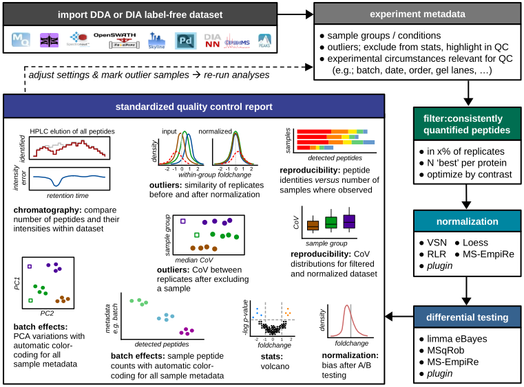

<!-- README.md is generated from README.Rmd using devtools::build_readme() -->

# MS-DAP

The Mass Spectrometry Downstream Analysis Pipeline is an all-in-one tool
for the interpretation of label-free proteomics datasets. Its major
features are extensive quality control, integration of state-of-the-art
algorithms for differential testing and intuitive visualization and
reporting.

We are currently preparing a manuscript for publication, feel free to
explore the documentation and beta-version of MS-DAP in this GitHub
repository meanwhile \!

## overview

## Installation

MS-DAP is available as a [Docker container](doc/docker.md) that includes
everything required to get starting right away, and as a [R
package](doc/rpackage.md) that may be installed into a preexisting
bioinformatics workflow.

1)  Installing the dockerized version of MS-DAP is trivialized to first
    installing the Docker application and then pulling the MS-DAP
    container from the online Docker repository ( [as shown in this
    guide](doc/docker.md) ). Using containers guarantees the exact same
    software versions are used throughout the entire stack, from
    operating system to the actual application, a crucial aspect of
    software reproducibility. As the MS-DAP application matures, users
    can re-run analyses on any legacy MS-DAP release by simply pulling
    the respective container version (e.g. to repeat a previously
    published analysis).

2)  Already working with R? [Click here for an installation
    guide](doc/rpackage.md) to install the MS-DAP R package.

## Using MS-DAP

The introduction vignette illustrates how MS-DAP works and showcases a
diverse set of data visualizations from real datasets to highlight how
MS-DAP can help you extract more value from your experimental data.

The second vignette is a more hands-on tutorial that describes how to
prepare input data and how to configure parameters of this data analysis
pipeline.

Bioinformatic analyses beyond the typical MS-DAP workflow are described
in the following vignettes, from a more detailed look at differential
testing to integrating alternative algorithms for normalization or
Differential Expression Analysis (DEA).

  - [introduction to MS-DAP](doc/intro.md)
  - [user guide](doc/userguide.md)
  - [bioinformatics: differential expression analysis
    (DEA)](doc/differential_expression_analysis.md)
  - [bioinformatics: differential
    detection](doc/differential_detection.md)
  - [bioinformatics: plugin custom normalization or
    DEA](doc/custom_norm_dea.md)

## Roadmap

Features planned for future releases:

  - compatibility with the recent R 4.0 release
  - expand upstream software support
  - labeled quantitative data; iTRAQ/TMT
