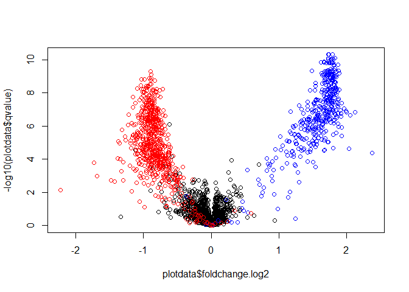

- [load dataset](#load-dataset)
- [filtering and normalization](#filtering-and-normalization)
- [applying linear regression with
  limma](#applying-linear-regression-with-limma)
  - [advanced experimental design: paired samples and
    blocking](#advanced-experimental-design-paired-samples-and-blocking)
  - [advanced experimental design: multi-level
    experiments](#advanced-experimental-design-multi-level-experiments)
- [plotting results](#plotting-results)
- [validation](#validation)

This vignette demonstrates how the MS-DAP R package can help you perform
differential expression analysis (DEA) with custom linear regression
models. *Note that this requires MS-DAP version 1.2 or later.*

For all typical case *vs* control analyses (A/B testing), you can use
the default MS-DAP workflow as described on the main page. However, for
some studies we might have to deal with repeated measurement models (by
creating a “block design”) or create linear regression models that
feature interactions. We here show how to apply custom regression models
to your dataset with MS-DAP.

Additional documentation and examples for creating experimental designs
can be found in the limma user guide, section 9;
<https://bioconductor.org/packages/release/bioc/vignettes/limma/inst/doc/usersguide.pdf>

note: in the code blocks shown below (grey areas), the lines that start
with `#>` are the respective output that would be printed to the console
if you run these code snippets on your computer

## load dataset

In this demo we’ll use the Skyline output of the LFQbench study
(<PMID:27701404>) that is already bundled with the MS-DAP package. Not a
dataset that requires anything other than A/B testing, but it’s a
convenient example because the data is ready to go.

Note that we here parse the sample-to-group assignments straight from
the sample filenames. But in typical workflows, this script would start
with;

- dataset = import_dataset_diann(…)
- dataset = import_fasta(…)
- dataset = import_sample_metadata(…)

``` r
library(msdap)

f <- system.file("extdata", "Skyline_HYE124_TTOF5600_64var_it2.tsv.gz", package = "msdap")
dataset = import_dataset_skyline(f, confidence_threshold = 0.01, return_decoys = F, acquisition_mode = "dia")
#> info: reading Skyline report...
#> info: input file: C:/VU/code/R/msdap/inst/extdata/Skyline_HYE124_TTOF5600_64var_it2.tsv.gz
#> info: 4 unique target (plain)sequences ambiguously mapped to multiple proteins and thus removed. Examples; TTDVTGTIELPEGVEMVMPGDNIK, LNIISNLDCVNEVIGIR, LMDLSINK, EVDEQMLNVQNK
#> info: 34263/35943 precursors remain after selecting the 'best' precursor for each modified sequence
dataset = sample_metadata_custom(dataset, group_regex_array = c(A = "007|009|011", B = "008|010|012") )
print(dataset$samples %>% select(sample_id, group))
#> # A tibble: 6 × 2
#>   sample_id           group
#>   <chr>               <chr>
#> 1 lgillet_L150206_007 A    
#> 2 lgillet_L150206_009 A    
#> 3 lgillet_L150206_011 A    
#> 4 lgillet_L150206_008 B    
#> 5 lgillet_L150206_010 B    
#> 6 lgillet_L150206_012 B
```

## filtering and normalization

Assuming that your sample metadata table has a column named “group” that
describes your main experimental conditions, we’ll first apply filtering
and normalization such that only peptides that were detected in 75% of
all samples *per group* are retained. Note that if your dataset is DDA,
as opposed to DIA, you’d probably want to filter for “quantified in 75%
of samples per group” instead (because “detect” for DDA implies MS/MS
detection / PSM, whereas for DIA “detect” implies upstream software
assigned a strong confidence - the latter is much more common than
consistent MS/MS detection in DDA).

For normalization, we’ll first apply the “vsn” algorithm at
peptide-level and then perform “modebetween_protein” to ensure the
protein-level mode log2fc between “groups” is zero.

``` r
dataset = filter_dataset(dataset, filter_min_detect = 3, filter_fraction_detect = 0.75, all_group = TRUE, norm_algorithm = c("vsn", "modebetween_protein"))
#> progress: caching filter data took 2 seconds
#> info: filter dataset with settings: min_detect = 3; fraction_detect = 0.75; norm_algorithm = 'vsn&modebetween_protein'; rollup_algorithm = 'maxlfq'
#> 12756/34263 peptides were retained after filtering over all groups
#> progress: peptide filtering and normalization took 3 seconds
```

## applying linear regression with limma

In this section we will use MS-DAP helper functions (new since release
1.2) to easily perform linear regression with any user-specified model,
including block design and multi-level experiments. Below code shows how
implement a simple comparison between two independent groups, i.e. basic
A/B testing. The following two examples show more advanced experimental
designs.

``` r
### step 1: prepare data for regression
# First, print all peptide-level data that are available. This helper function prints all column names in the peptide table that can be used (i.e. these are the outcome of the filter_dataset() function)
print_available_filtering_results(dataset)
#> "intensity" = input data as-is
#> "intensity_all_group" = global data filter ('all_group')

# Create a protein*sample log2 intensity matrix based on the "all_group" filtering we applied previously
protein_data = get_protein_matrix(dataset, intensity_column = "intensity_all_group")

# Create a sample metadata table that matches the protein data matrix
# Importantly, this sample table is aligned with the protein matrix and downstream code critically assumes that you do not manually reorder the protein matrix nor reorder rows of the samples table
samples = get_samples_for_regression(dataset, protein_data)
#> info: categorical variable (R factor): group
print(samples)
#> # A tibble: 6 × 2
#>   sample_id           group
#>   <chr>               <fct>
#> 1 lgillet_L150206_007 A    
#> 2 lgillet_L150206_008 B    
#> 3 lgillet_L150206_009 A    
#> 4 lgillet_L150206_010 B    
#> 5 lgillet_L150206_011 A    
#> 6 lgillet_L150206_012 B

### step 2: define your regression model
# We here have full control over the linear regression model; create any model matrix and contrasts you want following limma syntax (c.f. limma user guide)
# In this example, we are making typical two-group comparisons between samples that are labeled as 'A' and 'B' in the group column of the samples table.
# Note that we here set "0+" to remove the intercept so we can create contrasts between values in the 'group' column in the next step (limma::makeContrasts())
design = stats::model.matrix( ~ 0 + group, data = samples)
# Print design matrix: we can use respective columns to create contrasts on the next line
print(design) 
#>   groupA groupB
#> 1      1      0
#> 2      0      1
#> 3      1      0
#> 4      0      1
#> 5      1      0
#> 6      0      1
#> attr(,"assign")
#> [1] 1 1
#> attr(,"contrasts")
#> attr(,"contrasts")$group
#> [1] "contr.treatment"

# Define 1 or more contrasts. Basic syntax: <contrast label> = <column name in 'design'> - <column name in 'design'>
design_contrasts = limma::makeContrasts(
  AvsB = groupB - groupA, # positive log2fc = higher abundance in first-listed group
  # suppose there there are multiple groups, we could here add additional comparisons as follows:
  # BvsC = groupC - groupB,
  levels = design
)

### step 3: use MS-DAP helper function to easily apply this model to your data
# Result is a table that contains statistics for all specified contrasts
# Note that we can apply the DEqMS method for post-hoc adjustment of protein confidences according to their respective number of peptides.
result = limma_wrapper(protein_data, model_matrix = design, contrasts = design_contrasts, deqms = TRUE)
#> info: applying limma eBayes(), followed by DEqMS (to adjust protein confidences according to their respective number of peptides)

# Optionally, add protein metadata (fasta header and gene symbols)
# In the current test dataset we didn't use import_fasta(), but on real datasets this'll be useful
result = inner_join(
  dataset$proteins %>% select(protein_id, fasta_headers, gene_symbols_or_id),
  result,
  by = "protein_id"
) %>% arrange(pvalue)
print(head(result))
#> # A tibble: 6 × 10
#>   protein_id           fasta_headers gene_symbols_or_id contrast foldchange.log2
#>   <chr>                <chr>         <chr>              <chr>              <dbl>
#> 1 1/sp|P0A6F5|CH60_EC… 1/sp|P0A6F5|… 1/sp|P0A6F5|CH60_… AvsB                1.72
#> 2 1/sp|P0A6M8|EFG_ECO… 1/sp|P0A6M8|… 1/sp|P0A6M8|EFG_E… AvsB                1.79
#> 3 1/sp|P09373|PFLB_EC… 1/sp|P09373|… 1/sp|P09373|PFLB_… AvsB                1.79
#> 4 1/sp|P0A6Y8|DNAK_EC… 1/sp|P0A6Y8|… 1/sp|P0A6Y8|DNAK_… AvsB                1.73
#> 5 1/sp|P0A9Q7|ADHE_EC… 1/sp|P0A9Q7|… 1/sp|P0A9Q7|ADHE_… AvsB                1.83
#> 6 2/sp|P0CE48|EFTU2_E… 2/sp|P0CE48|… 2/sp|P0CE48|EFTU2… AvsB                1.73
#> # ℹ 5 more variables: effectsize <dbl>, standarddeviation <dbl>,
#> #   standarderror <dbl>, pvalue <dbl>, qvalue <dbl>
```

### advanced experimental design: paired samples and blocking

Following the example for a paired test from section 9.4 of the limma
user guide:

*Suppose an experiment is conducted to compare a new treatment (T) with
a control (C). Six dogs are used from three sib-ships. For each
sib-pair, one dog is given the treatment while the other dog is a
control. This produces the targets frame:*

| sample_id | group     | block |
|-----------|-----------|-------|
| File1     | control   | 1     |
| File2     | treatment | 1     |
| File3     | control   | 2     |
| File4     | treatment | 2     |
| File5     | control   | 3     |
| File6     | treatment | 3     |

Above sample table shows the experimental design from the limma example,
with minor adaptions to fit conventions in MS-DAP (also, the siblings /
“sib-ships” from the limma example are here encoded in the “block”
column). If your experimental design features larger “blocks” than 2, as
opposed to the paired design shown here, you can use the exact same
setup for encoding sample metadata and performing the regression
analyses (you may also use names/letters to indicate blocks, these are
automatically converted to factors by the MS-DAP functions that prepare
the samples table).

We could implement this experimental design in MS-DAP with a minor
adaption to the first example in this section:

``` r
# Same data prep as main example above
print_available_filtering_results(dataset)
protein_data = get_protein_matrix(dataset, intensity_column = "intensity_all_group")
samples = get_samples_for_regression(dataset, protein_data)
print(samples)

# regression formula to test the difference between control and treatment, within each block
design = stats::model.matrix( ~ 0 + block + group, data = samples)
print(design) # print design matrix: we can use respective columns to create contrasts on the next line
design_contrasts = limma::makeContrasts(
  # in this contrast specification, positive log2fc = higher abundance in treatment group
  control_vs_treatment = grouptreatment - groupcontrol, 
  levels = design
)

# Apply linear regression model to your data and let MS-DAP take care of details + apply DEqMS
result = limma_wrapper(
  protein_data, 
  model_matrix = design, 
  contrasts = design_contrasts, 
  deqms = TRUE
)

# add protein metadata and print results
result = inner_join(dataset$proteins %>% select(protein_id, fasta_headers, gene_symbols_or_id), result, by = "protein_id") %>% arrange(pvalue)
print(head(result))
```

### advanced experimental design: multi-level experiments

Following the example for a multi-level design from section 9.7 of the
limma user guide:

*This experiment involves 6 subjects, including 3 patients who have the
disease and 3 normal subjects. From each subject, we have expression
profiles of two tissue types, A and B. In analysing this experiment, we
want to compare the two tissue types. This comparison can be made within
subjects, because each subject yields a value for both tissues. We also
want to compare diseased subjects to normal subjects, but this
comparison is between subjects.*

| sample_id | group    | subject | tissue |
|-----------|----------|---------|--------|
| File1     | Diseased | 1       | A      |
| File2     | Diseased | 1       | B      |
| File3     | Diseased | 2       | A      |
| File4     | Diseased | 2       | B      |
| File5     | Diseased | 3       | A      |
| File6     | Diseased | 3       | B      |
| File7     | Normal   | 4       | A      |
| File8     | Normal   | 4       | B      |
| File9     | Normal   | 5       | A      |
| File10    | Normal   | 5       | B      |
| File11    | Normal   | 6       | A      |
| File12    | Normal   | 6       | B      |

Above sample table shows the experimental design from the limma example,
with minor adaptions to fit conventions in MS-DAP.

We could implement this experimental design in MS-DAP with a minor
adaption to the first example in this section. Note that in this
example, we have to 1) specify a new variable that combines group and
tissue information and 2) specify the `limma_block_variable` parameter
in the `limma_wrapper()` function.

``` r
# Same data prep as main example above
print_available_filtering_results(dataset)
protein_data = get_protein_matrix(dataset, intensity_column = "intensity_all_group")
samples = get_samples_for_regression(dataset, protein_data)
print(samples)

# Update the samples table to encode combinations of the subject's condition and the tissue
samples$treatment = factor(paste(samples$group, samples$tissue, sep = "."))

# Create the model matrix using this combination of group*tissue
design = stats::model.matrix( ~ 0 + treatment, data = samples)
print(design) # print design matrix: we can use respective columns to create contrasts on the next line

# Optionally, we can rename the columns of the design matrix (yields somewhat simpler names)
colnames(design) = levels(samples$treatment)
print(colnames(design)) # view updated column names

# create contrasts, analogous to the limma user guide:
design_contrasts = limma::makeContrasts(
  DiseasedvsNormalForTissueA = Diseased.A-Normal.A,
  DiseasedvsNormalForTissueB = Diseased.B-Normal.B,
  TissueAvsTissueBForNormal = Normal.B-Normal.A,
  TissueAvsTissueBForDiseased = Diseased.B-Diseased.A,
  control_vs_treatment = grouptreatment - groupcontrol,
  levels = design
)

# Apply linear regression model to your data and let MS-DAP take care of details + apply DEqMS.
# Importantly, we here specify that limma has to model the inter-subject correlation
# by providing the subject identifiers as a blocking variable.
result = limma_wrapper(
  protein_data, 
  model_matrix = design, 
  contrasts = design_contrasts, 
  limma_block_variable = samples$subject,
  deqms = TRUE
)

# add protein metadata and print results
result = inner_join(dataset$proteins %>% select(protein_id, fasta_headers, gene_symbols_or_id), result, by = "protein_id") %>% arrange(pvalue)
print(head(result))
```

## plotting results

When following the above example code that performs a custom linear
regression analysis with limma, you can use the following code snippet
to create typical MS-DAP -styled volcano plots:

``` r

# here assuming that `result` is the output from `limma_wrapper()` joined with the `dataset$proteins` table, as per above example.

plot_volcano_allcontrast(
  result, log2foldchange_threshold = 0, qvalue_threshold = 0.01, 
  label_mode = "topn_pvalue", label_target = 10, label_avoid_overlap = TRUE,
  mtitle = "volcano, label top 10", show_plots = TRUE
)
```

## validation

Appendum: we here validate that the first example shown above that
featured simple A/B testing, as implemented using MS-DAP utility
functions that enable flexible modeling with limma, yields the exact
same results as a typical MS-DAP workflow that uses
`msdap::analysis_quickstart()` or `msdap::dea()`.

``` r
# regular MS-DAP workflow: setup a contrast and apply the msdap::dea() function (which is also used when you use the typical msdap::analysis_quickstart() function)
dataset = setup_contrasts(dataset, contrast_list = list(c("A", "B")))
#> info: numeric variable: condition
#> info: contrast: A vs B # condition_variable: group
dataset = dea(dataset, dea_algorithm = "deqms")
#> info: differential expression analysis for contrast: A vs B # condition_variable: group
#> info: using data from peptide filter: global data filter
#> progress: DEqMS took 1 seconds

stopifnot(nrow(dataset$de_proteins) == nrow(result)) # same number of proteins
stopifnot(dataset$de_proteins$protein_id %in% result$protein_id) # same protein identifiers
# we here have only 1 contrast and 1 dea_algorithm, so we can simply align both tables using match()
index = match(dataset$de_proteins$protein_id, result$protein_id)
print(all.equal(dataset$de_proteins$pvalue, result$pvalue[index])) # same pvalues
#> [1] TRUE
print(all.equal(dataset$de_proteins$foldchange.log2, result$foldchange.log2[index])) # same log2fc
#> [1] TRUE

# bonus: validate LFQbench expected outcome by volcano plot; color-coded as yeast=red, ecoli=blue, hela=black
plotdata = result %>% mutate(is_yeast = grepl("_YEAS", protein_id), is_ecoli = grepl("_ECOL", protein_id)) %>% arrange(is_yeast, is_ecoli)
plot(plotdata$foldchange.log2, -log10(plotdata$qvalue), col = ifelse(plotdata$is_yeast, "red", ifelse(plotdata$is_ecoli, "blue", "black")) )
```

<!-- -->
