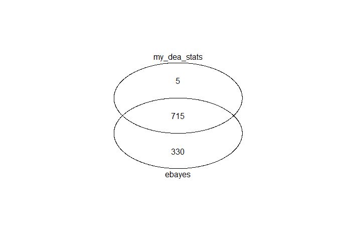

  - [prepare the dataset of analysis](#prepare-the-dataset-of-analysis)
  - [custom normalization function](#custom-normalization-function)
  - [custom DEA function](#custom-dea-function)
  - [let’s run MS-DAP \!](#lets-run-ms-dap)

This vignette demonstrates how you can plug custom functions into the
MS-DAP pipeline.

## prepare the dataset of analysis

One could use any dataset to demonstrate the use of custom functions for
normalization or DEA. Here we again use the Skyline dataset from the
LFQbench study bundled with MS-DAP (see other vignettes for refs and
data sources).

``` r
library(msdap)

f <- system.file("extdata", "Skyline_HYE124_TTOF5600_64var_it2.tsv.gz", package = "msdap")
dataset = import_dataset_skyline(f, confidence_threshold = 0.01, return_decoys = F, acquisition_mode = "dia")
#> info: reading Skyline report...
#> info: 4 unique target (plain)sequences ambiguously mapped to multiple proteins and thus removed. Examples; TTDVTGTIELPEGVEMVMPGDNIK, LNIISNLDCVNEVIGIR, LMDLSINK, EVDEQMLNVQNK
#> info: 34263/35943 precursors remain after selecting the 'best' precursor for each modified sequence

dataset = sample_metadata_custom(dataset, group_regex_array = c(A = "007|009|011", B = "008|010|012") )

dataset = setup_contrasts(dataset, contrast_list = list(c("A", "B")))
#> info: contrast: A vs B

print(dataset$samples %>% select(sample_id, group))
#> # A tibble: 6 x 2
#>   sample_id           group
#>   <chr>               <chr>
#> 1 lgillet_L150206_007 A    
#> 2 lgillet_L150206_009 A    
#> 3 lgillet_L150206_011 A    
#> 4 lgillet_L150206_008 B    
#> 5 lgillet_L150206_010 B    
#> 6 lgillet_L150206_012 B
```

## custom normalization function

We here implement a simple normalization approach to illustrate the
technique for providing MS-DAP with a custom normalization function. The
code below implements quantile normalization.

The hard requirements to make this work are:

1)  your normalization function must have a unique name that does not
    overlap with common R functions (bad name: ‘mean’). So pick names
    ‘mynorm\_quantile’ or ‘my\_norm\_v1’

2)  the function must have the following parameters: x\_as\_log2,
    mask\_sample\_groups

<!-- end list -->

  - x\_as\_log2 = log2 transformed peptide intensity data matrix, where
    each row is a peptide and each column a sample
  - mask\_sample\_groups = array of characters that describes the sample
    grouping (which columns belong to the same sample group). you must
    implement this argument when creating your function, but you may
    choose to not use this information while normalizing (as we do in
    the example below)

<!-- end list -->

3)  return data has to be of the *exact* same format as x\_as\_log2 (but
    with normalized abundance values)

<!-- end list -->

``` r
my_norm = function(x_as_log2, mask_sample_groups = NA) {
  cat("Example custom normalization implementation, my_norm(), scaling all samples by some quantile\n")
  quantile_for_normalization = 0.95
  # value at quantile x for each column/sample
  scale_per_sample = matrixStats::colQuantiles(x_as_log2, probs = quantile_for_normalization, na.rm=T)
  # instead of scaling samples such that quantile x is zero, adjust by mean shift so output values are of the same order as input
  scale_per_sample = scale_per_sample - mean(scale_per_sample)
  # apply scaling to each column (transpose, scale 'rows', then transpose again)
  return(t(t(x_as_log2) - scale_per_sample))
}
```

now that we have implemented a normalization function, let’s run a very
basic data matrix to test if it works;

``` r
mock_data = cbind(1:6, 2:7, 0:5)
print(mock_data)
#>      [,1] [,2] [,3]
#> [1,]    1    2    0
#> [2,]    2    3    1
#> [3,]    3    4    2
#> [4,]    4    5    3
#> [5,]    5    6    4
#> [6,]    6    7    5
print(my_norm(mock_data))
#> Example custom normalization implementation, my_norm(), scaling all samples by some quantile
#>      [,1] [,2] [,3]
#> [1,]    1    1    1
#> [2,]    2    2    2
#> [3,]    3    3    3
#> [4,]    4    4    4
#> [5,]    5    5    5
#> [6,]    6    6    6
```

In the last section of this document, we’ll use this new normalization
function in MS-DAP

## custom DEA function

Below we have implemented a simplified DEA function that applies the a
t.test() on protein abundances.

The first two requirements from the previous section apply here was
well, but the list of required parameters here is;

  - peptides; long-format tibble of peptide data. For most use-cases, we
    advise using either the peptide- or protein-level ExpressionSet
  - samples; tibble with sample metadata, take note of the columns
    ‘sample\_id’ and ‘condition’ so you can classify samples into
    conditions while A/B testing
  - eset\_peptides; ExpressionSet for peptides
  - eset\_proteins; ExpressionSet for proteins (collapsed peptide-level
    data)
  - input\_intensities\_are\_log2 = boolean that tells you whether the
    intensities are log2 transformed (they are by default, but could
    change in future, so implement a check like below)

The return data must be a tibble with these columns;

  - protein\_id
  - pvalue
  - qvalue
  - foldchange.log2
  - algo\_de = name of your algorithm. must be a non-empty character
    string uniquely indicating the name/label of your method. DO NOT use
    names already used by other methods in this pipeline, like ‘ebayes’

The example code, together with code comments, should provide a code
skeleton for the implementation of your custom DEA algorithm.

``` r
my_dea_stats = function(peptides, samples, eset_peptides, eset_proteins, input_intensities_are_log2) {
  ### 1) from provided protein-level data; extract the protein intensity matrix, to which condition each sample belongs and find the columns matching groups 1 and 2
  x = Biobase::exprs(eset_proteins)
  # transform to log2 if input data is non-log
  if (!input_intensities_are_log2) {
    x = log2(x)
  }
  # set non-finite values to NA
  x[!is.finite(x)] = NA
  # extract groups
  x_groups = pData(eset_proteins)$condition
  x_groups_unique = unique(x_groups)
  # assume there are 2 groups
  stopifnot(length(x_groups_unique) == 2)
  cols_grp1 = x_groups == x_groups_unique[1]
  cols_grp2 = x_groups == x_groups_unique[2]

  ### 2) calculate p-values for each protein
  pval = rep(NA, nrow(x))
  for(i in 1:nrow(x)) {
    i_tt = t.test(x[i,cols_grp1], x[i,cols_grp2], alternative = "two.sided", paired = FALSE, var.equal = FALSE)
    pval[i] = i_tt$p.value
  }
  # log2 fold-change
  log2FC = rowMeans(x[,cols_grp2,drop=F], na.rm=T) - rowMeans(x[,cols_grp1,drop=F], na.rm=T)

  ### 3) create a result tibble that contains all columns required for downstream compatability with this pipeline; protein_id, pvalue, qvalue, foldchange.log2, algo_de
  result = tibble(protein_id = rownames(x),
                  pvalue = pval,
                  qvalue = p.adjust(pval, method = "fdr"),
                  foldchange.log2 = log2FC,
                  # the name of your algorithm. must be a non-empty character string uniquely indicating the name/label of your method (eg; do NOT use names already used by other methods in this pipeline, like 'ebayes')
                  algo_de = "my_dea_stats")

  cat("Example custom DEA implementation, my_dea_stats(), yielded", sum(is.finite(result$qvalue) & result$qvalue<=0.01), "hits at qvalue<=0.01\n")
  return(result)
}
```

## let’s run MS-DAP \!

To use a custom function, we just write the *name of the R function* as
parameters. Do not confuse this with the ‘algo\_de’ name given in the
result tibble of your dea function, that is merely the label used in
output plots and tables. We remember the LFQbench dataset is a
comparison of 2 conditions with 3 replicated measurements each, and
apply feature selection rules accordingly.

note that ‘dea\_norm\_modebetween\_protein\_eset’ is a crucial parameter
in this case, while testing our custom normalization function.

``` r
dataset = analysis_quickstart(dataset,
                              filter_min_detect = 2,
                              filter_min_quant = 3,
                              norm_algorithm = "my_norm", # custom norm !
                              dea_norm_modebetween_protein_eset = FALSE, # do not apply additional normalization on protein-level after roll-up from "my_norm" normalized peptides to protein-level
                              dea_algorithm = c("ebayes", "my_dea_stats"), # we use good ol' eBayes for reference, and our custom dea !
                              dea_qvalue_threshold = 0.05,
                              dea_log2foldchange_threshold = NA, # estimate a fold-change threshold for proteins to be significant
                              output_qc_report = FALSE, # disabled in this document, but do create a QC report when testing code to review those volcano's, p-value and foldchange distributions !
                              output_peptide_plots = "none",
                              output_dir = getwd(), # optionally, change the output directory (now files are printed to the working directory)
                              output_within_timestamped_subdirectory = FALSE)
#> progress: caching filter data took 2 seconds
#> Example custom normalization implementation, my_norm(), scaling all samples by some quantile
#> Example custom normalization implementation, my_norm(), scaling all samples by some quantile
#> progress: peptide filtering and normalization took 3 seconds
#> info: differential abundance analysis for contrast: A vs B
#> info: using data from peptide filter: global data filter
#> info: log2 foldchange threshold estimated by bootstrap analysis: 0.628
#> progress: eBayes took 1 seconds
#> Example custom DEA implementation, my_dea_stats(), yielded 728 hits at qvalue<=0.01
```

Print the number of significant proteins

``` r
print(dataset$de_proteins %>% 
        group_by(algo_de) %>% 
        summarise(`1% FDR` = sum(qvalue <= 0.01),
                  `1% FDR AND foldchange threshold` = sum(qvalue <= 0.01 & signif)))
#> `summarise()` ungrouping output (override with `.groups` argument)
#> # A tibble: 2 x 3
#>   algo_de      `1% FDR` `1% FDR AND foldchange threshold`
#>   <chr>           <int>                             <int>
#> 1 ebayes           1054                              1002
#> 2 my_dea_stats      728                               709
```

A simple Venn diagram of proteins at 1% FDR for each method shows our
custom function identifies a subset of the results from limma’s ebayes
function, so we verified that the example implementation doesn’t yield
random stuff.

``` r
gplots::venn(list(ebayes=dataset$de_proteins %>% filter(algo_de=="ebayes" & qvalue <= 0.01) %>% pull(protein_id),
                  my_dea_stats=dataset$de_proteins %>% filter(algo_de=="my_dea_stats" & qvalue <= 0.01) %>% pull(protein_id)))
```

<!-- -->
