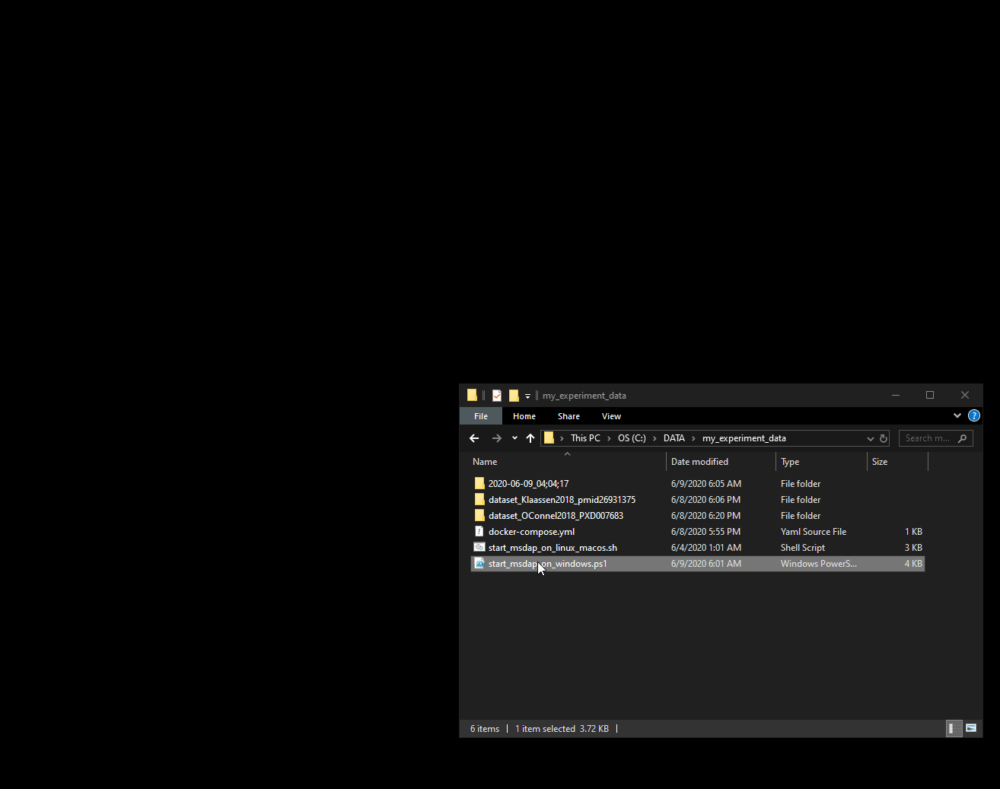

---
output:
  github_document:
    html_preview: true
    toc: false
---

# Using the Dockerized MS-DAP

<!-- 
A short demonstration of the _Dockerized_ MS-DAP, where you simply install Docker and then run a single script to get both RStudio (to run R code/scripts) and a graphical user interface for MS-DAP up-and-running:



The demo stops short of inspecting the actual pipeline result files, you can refer to the [introduction vignette](intro.md) for an overview of MS-DAP output.

(And of course you can also use the GUI without Docker, if you installed just the R package simply run `library(msdap); gui()`)

 -->

## install Docker for Windows or macOS

- download and install Docker for Windows/macOS at: https://www.docker.com/products/docker-desktop
- configure Docker
	- start Docker Desktop
	- open the settings screen
		- windows; right-click the Docker icon in the taskbar at bottom-right of the screen (looks like a whale, you may need to click the little arrow on the windows taskbar if icons are hidden)  >  click settings
		- macOS; Docker > menu bar > Preferences
	- update settings
		- resources > advanced: set number of CPUs to use (if in doubt, set to at least 4)
		- resources > advanced: set amount of RAM to use (if in doubt, set to at least 8GB at least)
		- resources > file sharing: click the + symbol and select the directory that holds all your experimental data (eg; C:/data)
- rebooting your system after installing Docker Desktop (not strictly required, but consider it a workaround for common issues)


## install Docker on Linux

follow the official installation guide for your Linux distribution at: https://docs.docker.com/engine/install/


## Start the Docker container using the launcher script

A launcher script is provided for user convenience; it executes all commands needed to run the MS-DAP docker container. To do this manually instead, consult the next section for a step-by-step guide.

- download the script for the MS-DAP version you want to use at the [‘releases’ section of this github repository](/releases)
- copy/move the launcher script to the directory that holds your experiment data (eg; `C:/data/proteomics/`)
  - the file location is important: only data with the directory that contains the launcher script will be accessible within the Docker container. See further, subsection **Locating your mounted data within Docker containers**
- run the script to launch MS-DAP
  - windows; right-click `msdap_launcher_windows.ps1` and select "Run with PowerShell"
    - _note; upon first use, you may get a security warning since this is a script you downloaded from the internet_
  - macOS and Linux; execute the `msdap_launcher_unix.sh` script
    - _note; on Linux, you need to make sure the Docker service is running prior to starting the script_


note: to use a different MS-DAP version, simply change the version number at the top of the launcher script. To view all available MS-DAP Docker containers, go to: https://hub.docker.com/repository/docker/ftwkoopmans/msdap


### what does the script do?

- if Docker is not up-and-running, start Docker
- the launcher script will automatically download the MS-DAP container (if needed)
- if MS-DAP is already up-and-running, stop it
- start the MS-DAP docker container
- your default web browser is launched and navigates to a local webserver within the Docker container @ http://localhost:3839


## Start the Docker container from the commandline

1) First, make sure that Docker is up and running. For Windows and macOS, simply start the Docker Desktop application. 
- On Windows, you may hover the mouse cursor over the Docker tray icon that looks like a whale in the bottom-right section of the taskbar to confirm its status is "Docker Desktop is running" (if no icon is visible but you did start Docker, maybe the icon is hidden and you have to click the icon on the bottom-right of the Windows taskbar to "Show hidden icons").

2) Next, start a terminal. On Windows, start powershell (start > type: `powershell` > click `Windows PowerShell` icon). On macOS, open Terminal.

3) Download the MS-DAP Docker container by executing the following command in the terminal (only have to do this 'installation step' once):

```docker pull ftwkoopmans/msdap:0.2.2```

4) Run the Docker container and give it access to the directory on your computer (the 'host' system) that contains the proteomics data. 
**importantly, Docker containers only have access to files on the host system that are explicitly mounted: update the highlighted path in the following command** (see further @ next subsection).

<code>docker run -p 3839:8787 -e PASSWORD=msdap -v **C:/data/proteomics**:/data -it ftwkoopmans/msdap:0.2.2</code>

5) Open a browser, such as Firefox or Chrome, and access MS-DAP at http://localhost:3839 . You will be presented with a complete RStudio environment that contains MS-DAP! username: `rstudio` password: `msdap` (we suggest you permit your browser to store these credentials for future re-use)

note: to stop the container, go to the terminal used to launch MS-DAP and press `control + C`.

note: to use a different MS-DAP version, simply change the version number in both docker commands. To view all available MS-DAP Docker containers, go to: https://hub.docker.com/repository/docker/ftwkoopmans/msdap


## Locating your mounted data within Docker containers

Docker containers only have access to files on the host system that are explicitly mounted. So if for example all proteomics datasets are located in `C:/data/proteomics` on your computer  (the 'host' system), we will mount this directory in the Docker container to make its contents available to the software running inside the container at file location `/data` (as seen within the container).

**example: your data is located in C:/data/proteomics/...**

| Host system   | as seen within container |
| ------------- | ------------- |
| C:/data/proteomics | /data |
| C:/data/proteomics/exp1  | /data/exp1 |
| C:/data/proteomics/exp1/fasta  | /data/exp1/fasta |

For reference, the syntax of this command: `docker run ... -v <FULL PATH ON YOUR SYSTEM>:/data ...` (the `/data` is the file location as seen from _within_ the container and should not be altered).


### Quickstart: graphical user interface

Launch the MS-DAP GUI and analyze the Klaassen et al. (2018) dataset that was pre-processed with MetaMorpheus and included with MS-DAP.

- To immediately view the expected results, [click here to download the PDF report](/examples/data/dataset_Klaassen2018_pmid26931375_report.pdf) we already prepared and uploaded.


Launching the GUI:

- assuming the MS-DAP Docker container is running and you accessed it using a web-browser at http://localhost:3839
- start the MS-DAP graphical user interface (GUI) by running the following R command in the RStudio console at the bottom-left of the RStudio interface: `msdap::gui()` 

Data analysis steps:

- upstream software: _MetaMorpheus_
- input data: browse files > select _exampledata_ from the dropdown menu in the top-right > left-click the folder with the Klaassen et al. dataset in the _Directories_ panel > click select button on the bottom
- fasta: browse files > select both fasta files: left-click the first, hold shift, left-click the second fasta file (note that this shows the files from the most recent directory) > click select button on the bottom
- output directory: select dir > select _data_ from the dropdown menu in the top-right > either select 'data' (grey icon on top-left) to store files in the _mapped directory_ or create a new folder and select that. Note that MS-DAP results are stored in a subdirectory of the location you choose here.
- _next_
- load sample metadata table: double-click sample_metadata.xlsx
- _next_
- optionally, define a statistical contrast: drag and drop sample groups to 'A' and 'B' (or leave all groups at 'unused' to skip A/B testing)
- identified sample count: 1
- DEA algorithm: msqrob and msempire
- _start analysis_
- output log and result summary are shown in the GUI
- output files can be found in the _output directory_


### Quickstart: an example R script

Use a snippet of R code that uses the MS-DAP R package to analyse the Klaassen et al. (2018) dataset that was pre-processed with MetaMorpheus and included with MS-DAP:

- To immediately view the expected results, [click here to download the PDF report](/examples/data/dataset_Klaassen2018_pmid26931375_report.pdf) we already prepared and uploaded.

Data analysis steps:

- assuming the MS-DAP Docker container is running and you accessed it using a web-browser at http://localhost:3839
- in the RStudio menu on the top-left; file > New File > R Script
- copy/paste the below code snippet to the panel in center of the screen
- run all lines of code: select all (by mouse drag or click anywhere then `control+A`)  >  click the `run` button on top of the code panel to run all selected lines
- output log and result summary are shown at the bottom of the screen
- output files can be found in the _mapped directory_ that you defined when launching MS-DAP

```{r eval=FALSE}
library(msdap)

# set working directory. use forward slashes in file paths
setwd("/exampledata/dataset_Klaassen2018_pmid26931375")
# load the dataset
dataset = import_dataset_metamorpheus(path = getwd(), protein_qval_threshold = 0.05)
# gather protein information, such as gene symbols, from fasta files
dataset = import_fasta(dataset, files = c("UP000000589_10090.fasta", "UP000000589_10090_additional.fasta"))
# optionally, we can apply filters to protein names. here we remove keratin and IGGs from the IP dataset
dataset = remove_proteins_by_name(dataset, regular_expression = "ig \\S+ chain|keratin|GN=(krt|try|igk|igg|igkv|ighv|ighg)")
# import sample metadata and define a contrast for DEA
dataset = import_sample_metadata(dataset, filename = "sample_metadata.xlsx")
dataset = setup_contrasts(dataset, contrast_list = list(c("wt", "ko")))
# run the pipeline. check the documentation by running the R command: ?analysis_quickstart
dataset = analysis_quickstart(dataset,
                              filter_min_detect = 1,
                              filter_min_quant = 3,
                              filter_by_contrast = FALSE,
                              norm_algorithm = "msempire",
                              dea_algorithm = c("ebayes", "msempire", "msqrob"),
                              dea_qvalue_threshold = 0.05,
                              dea_log2foldchange_threshold = NA,
                              output_qc_report = TRUE,
                              # note; within the Docker container, /data maps to the directory on your computer
                              # defined when launching the MS-DAP Docker container
                              output_dir = "/data/dataset_Klaassen2018_pmid26931375",
                              output_within_timestamped_subdirectory = TRUE)
# optionally, print a brief summary to console
print_dataset_summary(dataset)
```


### troubleshooting

**documentation from Docker to verify your Docker installation is ok**

- https://docs.docker.com/docker-for-windows/
- https://docs.docker.com/docker-for-mac/


**cannot locate input data from within the Docker container**

1) double-check that the _mapped directory_ is correctly provided when starting the Docker container, as detailed in the above documentation.

2) within the MS-DAP bundled RStudio at http://localhost:3839 ; run the following R command in the console (on the bottom of the RStudio interface) to list all files in the _mapped directory_ `/data` to verify whether your data is visible from within the container: `dir("/data")`


**timestamped MS-DAP output directories do not match the current time**

This is a known issue; the timezone of the Docker container (and R runtime within) does not match the host computer (a solution is scheduled for the next release)
