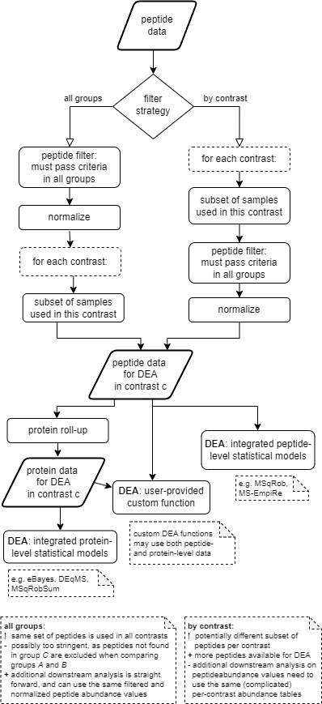
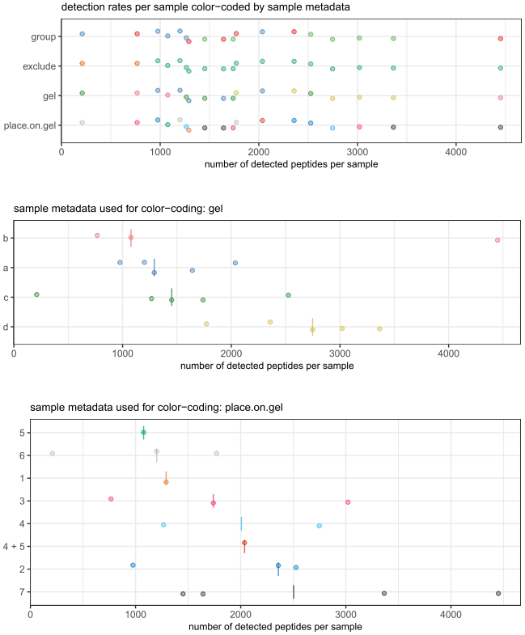
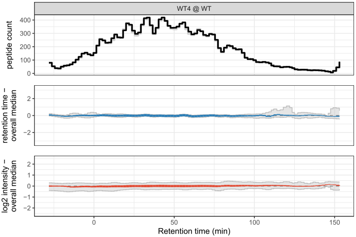
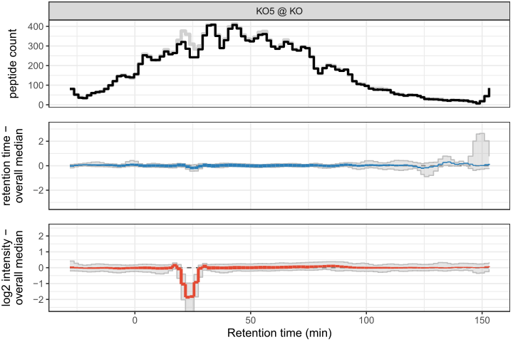
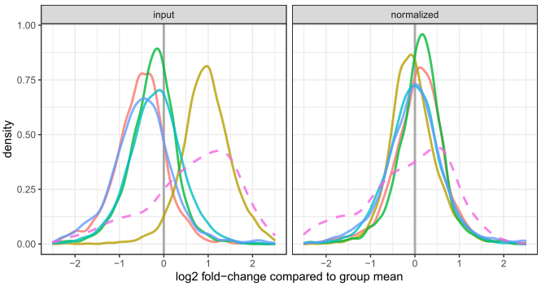
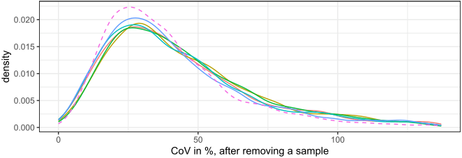
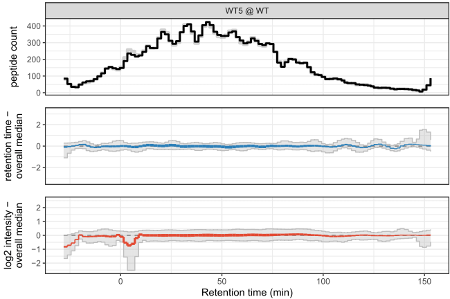
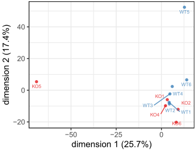
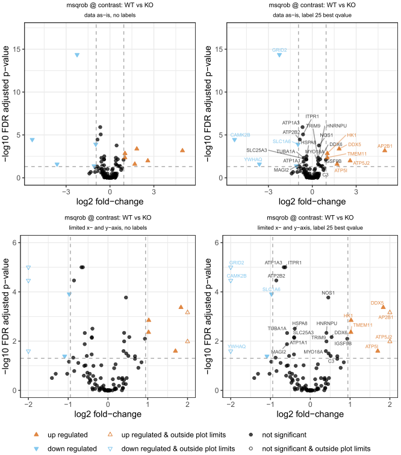
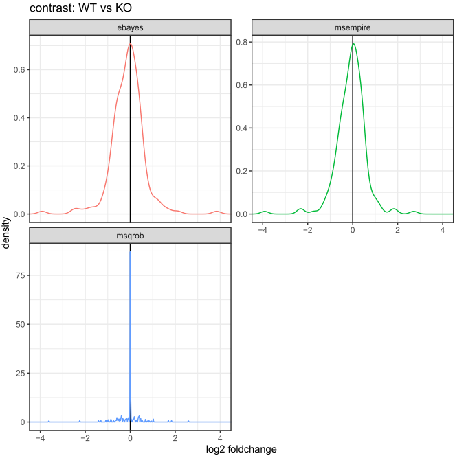

---
output:
  rmarkdown::github_document:
    html_preview: true
    toc: true
---

```{r, include = FALSE}
knitr::opts_chunk$set(
  collapse = TRUE,
  fig.path = "images/intro-",
  comment = "#>"
)
```


This document provides an introduction to MS-DAP; what is it and how does it work, together with highlights from the MS-DAP quality control report.

Instead of demonstrating MS-DAP using output from a single 'representative' dataset, we have collected interesting samples/datasets specifically to highlight several quality control analyses and issues you may encounter while working with your data.

_For a hands-on tutorial that shows how to perform MS-DAP analyses together with a description of settings and recommended defaults, please refer to the **getting started** vignette._


## abstract

Essential steps in the interpretation of any mass spectrometry based proteomics experiment are quality control and statistical analysis of protein abundance levels. In this rapidly moving field novel algorithms are being developed and many tools have become available for the various downstream analysis steps of label-free proteomics data leading to an extensive patchwork of tools and analyses used throughout the proteomics community. With MS-DAP we present a data analysis pipeline that facilitates reproducible proteome science through extensive quality control, integration of state-of-the-art algorithms for differential testing and intuitive visualization and reporting. Feature selection criteria can be configured such that differential testing is only performed on the subset of reliably quantified peptides. Custom functions for normalization or differential expression analysis can be used as a plugin to encourage inclusion of future algorithmic innovations.


## Features

{width=50%}

MS-DAP, Mass Spectrometry Downstream Analysis Pipeline:

- Analysis independent of RAW data processing software
- Wide selection of normalization algorithms and statistical models
- Plugin architecture to support future algorithms
- Standardized workflow, regardless of configured feature selection and data processing algorithms
- Extensive data visualization, including both popular/common plots and novelties introduced by MS-DAP, covering many quality control aspects
- The report is a single PDF, making your results easy to share online
- The publication-grade figures are stored as vector graphics, so simply open the report PDF in Adobe Illustrator to include any of the MS-DAP visualizations as panels in your main figures
- Available as a Docker container and R package


## Computational procedures involved in differential expression analysis

Various computational procedures can be selected in the Differential Expression Analysis (DEA) (Flowchart). MS-DAP provides two distinct peptide filtering strategies, dataset wide or separately for each contrast, in a highly configurable framework that allows users to configure feature selection, normalization and DEA algorithms of choice.

{width=25%}


### DEA-workflow: feature selection

Feature selection is an important first step in which one decides on which peptides represent reliable data that should be used in downstream statistical analysis. The following criteria are available to determine whether a peptide is 'valid' in a sample group:

- identified in at least N samples
- identified in at least x% of samples
- quantified in at least N samples
- quantified in at least x% of samples
- topN peptides per protein; after above filters, rank peptides by the number of samples where detected and their overall CoV and keep the top N
- the respective protein has at least N peptides that pass the above filters

'identified' refers to peptide p in sample s was identified through MS/MS for DDA datasets, or identified with a confidence qvalue <= 0.01 for DIA datasets. Quantified refers to datapoints either identified and quantified or not identified but their abundance was inferred through match-between-runs.


### DEA-workflow: normalization

A second important step is to choose the normalization procedure. There are different normalization algorithms available in MS-DAP:

- median, simply scale each sample such that the median value is the same throughout the dataset
- VSN, from vsn R package (justvsn)
- Loess, from limma R package; normalizeCyclicLoess(log2_data, iterations = 10, method = "fast")
- RLR, from MSqRob R package; normalizeRLR @ https://github.com/statOmics/MSqRob/blob/MSqRob0.7.6/R/preprocess_MaxQuant.R
- MS-EmpiRe, mode normalization as implemented in msEmpiRe R package
- VWMB, Variation Within Mode Between (novel, manuscript is a work-in-progress)
- modebetween, application of VWMB to only normalize between groups (replicates within each group are all scaled in the exact same manner)


## Quality Control

MS-DAP builds a report that allows in depth quality control (QC). Building blocks of the QC report are:

- individual samples analyzed through identified peptides and chromatographic effects
- reproducibility & outliers visualized among replicates
- presentation of dataset-wide effects; identification of batch effects through PCA
- information needed to reproduce results

The QC report can be used to evaluate data that thereafter is subsequently re-analyzed. For instance, after inspection the report users are encouraged to flag suspicious samples as 'exclude' so they are not taken into account during differential abundance analysis, instead of removing them from the dataset entirely. By keeping all samples in the dataset the MS-DAP QC report enables transparancy and shows _why_ samples were removed.

In the sections below a subset of all MS-DAP QC figures is highlighted to showcase the wide scope of quality control included. To see what a full QC report looks like, you can directly view the results of the quickstart example from the installation guide by [clicking this download link](/examples/data/dataset_Klaassen2018_pmid26931375_report.pdf).


### sample metadata

MS-DAP allows you to inspect potential sources of bias in the sample set. We therefore strongly encourage annotation of the samples in your dataset with experimental conditions relevant for QC, such as experiment batch, SDS-PAGE gel number (if multiple were used), order of sample processing and measurement, etc. This sample metadata can be provided as a table (Excel or plain-text csv/tsv).

MS-DAP generates a template file that is almost ready to go, you only have to open it in Excel and provide the sample groups and add additional columns that describe experimental conditions!

For example, after you've loaded your dataset (eg; on the next line after `msdap::import_dataset_skyline(...)`) you can write a sample metadata template file using `msdap::write_template_for_sample_metadata(dataset, filename = "C:/temp/samples.xlsx")`, edit it in Excel, close Excel, then read it back into R using `msdap::import_sample_metadata(dataset, filename = "C:/temp/samples.xlsx")`.


### detect counts

The number of detected peptides in a sample, as compared to other samples in the dataset, is a proxy for experiment quality.

In this example we apply MS-DAP to an in-house DDA dataset that makes use of SDS-PAGE gels to demonstrate how MS-DAP automatically generates QC figures for all provided sample metadata. In this dataset, we have 4 gels (a-d) and the location on the gel is also annotated (note that for one sample we merged gel lanes 4 and 5, in the sample metadata table we simply denoted this as '4 + 5').

Below figures are a screenshot from the QC report; the first panel describes all sample metadata provided in this dataset, samples on each row are color-coded according to respective metadata. The Following panels further detail each row of this figure. Taken together, these allow you to identify whether some technical aspect coincides with a systematic reduction in peptide identification.

In this example, gel d clearly was the most successful 'experiment batch' and we observe a troublesome difference in peptide detection counts between gels.




### chromatography

MS-DAP quality control analyses can help identify temporary problems while a sample elutes over the HPLC column. This allows to identify technical problems that may otherwise be mistakingly interpreted as biological effects.

For instance, suppose that sensitivity is strongly reduced (or the column is blocking) for a 10 minute period which results in decreased peptide intensities for the respective peptides eluting at the time. Or the sensitivity slowly decreases over time. Without quality control that considers the dimension 'retention time', we may not be aware of such problems but with MS-DAP we are. In fact, by including these analyses in the standard quality control repertoire, the presence or absence of technical issues is completely transparent to any reader of the QC report.

In the example below, we apply MS-DAP to an in-house SWATH-MS dataset where some measurements suffered from a temporary loss of measurement sensitivity. The first figure shows sample WT4; a typical example. The figure after shows sample KO5; note the drop in the number of detected peptides (top panel) and peptide abundances (bottom panel) at iRT 25 minutes.


**Typical sample:**



**Problematic sample; temporary drop in sensitivity**



**Figure legends:**
The top panel shows the number of peptides in the input data, e.g. as recognized by the software that generated input for this pipeline, over time (black line). For reference, the grey line shows the median amount over all samples (note; if this is the exact same in all samples, the grey line may not be visible as it falls behind the black line).

The middle panel indicates whether peptide retention times deviate from their median over all samples (blue line). The grey area depicts the 5% and 95% quantiles, respectively. The line width corresponds to the number of peptides eluting at that time (data from first panel). Analogously, the bottom panel shows the deviation in peptide abundance as compared to the median over all samples (red line).


### within-group foldchange distributions

_the need for another new figure_

The QC report includes a visualization of each sample's overall peptide abundance distributions (not shown here), which is a good indication of overall differences in sample loading and/or mass-spec sensitivity.  However, plotting abundance distributions for replicate measurements are sometimes mistaken for a sign of reproducibility of individual peptide/protein abundance values (it is not). For instance, if we would randomize the labels in one of the replicates the overall peptide/protein abundance distribution does not change but there surely are foldchanges in peptide/protein abundances.

_solution provided by MS-DAP_

The foldchange of all peptides in a sample is compared to their respective mean value over all samples in the group. This visualizes how strongly each sample deviates from other samples in the same group which helps identify outlier samples. In this analysis, the distributions are ideally centered narrowly around zero.

_example_

In the example below, we apply MS-DAP to an in-house DDA dataset and show a screenshot of the foldchange distributions for a sample group where;

1) the reproducibility is not great, although normalization helps the distributions don't overlap very well and are quite wide (considering the x-axis are log2 foldchanges and these were supposed to be biological replicates)

2) the sample we marked as 'exclude' in the sample metadata table (dashed line) clearly is an outlier compared to the other samples in the group


**Figure legends:**
The left- and right-side panels show results of the same analysis applied before and after application of normalization, respectively. Each line represents a sample and color-coding is consistent between panels. Samples marked as 'exclude' in the provided sample metadata table are visualized as dashed lines.

Note that this example figure is based on an in-house dataset (selected for its outliers that nicely illustrate this figure), so a legend that shows the sample names and their respective color-coding is omitted here but available in any QC report of course.





### CoV leave-one-out analysis

Downstream statistical analyses are empowered if the variation in peptide abundance values between replicated samples is lowered.

These analyses describe the effect of removing a particular sample prior to within−group Coefficient of Variation (CoV) computation. The lower the CoV distribution is for a sample, the better reproducibility we get by excluding it. Only sample groups with at least 4 replicates can be used for this analysis, so 3 samples remain after leaving one out. Samples marked as 'exclude' in the provided sample metadata are included in these analyses (shown as dashed lines), and only peptides with at least 3 data points across replicates samples (after leave-one-out) are used for each CoV computation.

Basically, CoV distributions as visualized here are like the left-half of a violin plot and the same criteria apply as with CoV box/violin-plots; ideally the majority of features have a low CoV, so the density shows a big hump close to zero and few values to the right (high CoV).

In the example below, we apply MS-DAP to an in-house DDA dataset and observe that the mode of the CoV distribution is much lower after removing the purple sample (already marked as 'exclude' in sample metadata).




**Figure legends:**
Samples marked as 'exclude' in the provided sample metadata table are visualized as dashed lines.

Note that this example figure is based on an in-house dataset (selected for its outliers that nicely illustrate this figure), so a legend that shows the sample names and their respective color-coding is omitted here but available in any QC report of course.


### PCA
A visualization of the first three PCA dimensions illustrates sample clustering. The goal of these figures is to detect global effects from a quality control perspective, such as samples from the same experiment batch clustering together, not to be sensitive to a minor subset of differentially abundant proteins (for which specialized statistical models can be applied downstream).

If additional sample metadata was provided, such as experiment batch, sample-prep dates, gel, etc., multiple PCA figures will be generated with respective color-codings. Users are encouraged to provide relevant experiment information as sample metadata and use these figures to search for unexpected batch effects.

The pcaMethods R package is used here to perform the Probabilistic PCA (PPCA). The set of peptides used for this analysis consists of those peptides that pass your filter criteria in every sample group. If any samples are marked as 'exclude' in the provided sample metadata, an additional PCA plot is generated with these samples included (depicting the 'exclude' samples as square symbols).

_Rationale behind data filter_

As mentioned above, the aim of the PCA figures is to identify global effects. To achieve this, we compute sample distances on the subset of peptides identified in each group which prevents rarely detected peptides/proteins from having a disproportionate effect on sample clustering. This pertains not only to 'randomly detected contaminant proteins' but also to proteins with abundance levels near the detection limit, which may be detected in only a subset of samples (eg; some measurements will be more successful/sensitive than others).


_on interpreting PCA_

Do note that for datasets where samples are very similar, for instance when the changes in protein abundances between phenotypes are minor, technical issues may have a stronger effect on PCA clustering than the phenotype (color-coding by sample groups). Whereas PCA is a common technique, we here show that;

1) the Probabilistic-PCA as used in MS-DAP corroborates individual QC plots indicating outlier samples (it works !)
2) the entire MS-DAP stack of QC analyses together allows users to backtrack outlier samples to upstream technical issues. Using this knowledge one can ‘exclude’ these samples and re-run MS-DAP to monitor the suspected positive effect on the analysis.
3) in absence of a relation between 'remarkable samples' and sample metadata, the data visualizations show that the peptide abundance variations among samples are not likely to be caused by (obvious) technical issues.

_example_

In the example below, we apply MS-DAP to an in-house DDA dataset and show a screenshot of (a subset of all) PCA visualizations. In the top panel, we can see how samples from all 3 groups are separated in principle components 1 and 2. In the bottom panel, we observe this separation by sample group (seen in the top panel) does not coincide with the SDS-PAGE gels used, demonstrating these dimension reductions capture a variation in peptide abundance values that coincides with phenotype not with the experiment technicality reviewed here.


**Figure legends**
The first 3 principle components compared visually (1 _vs_ 2, 1 _vs_ 3, 2 _vs_ 3) on the rows. Left- and right-side panels on each row represent the same figure without and with sample labels. The principle components are shown on the axis labels together with their respective percentage of variance explained. Samples marked as 'exclude' in the provided sample metadata, if any, are visualized as square shapes.

Note that this example figure is based on an in-house dataset, so sample and group names/labels are omitted here but available in any QC report of course.


### use the MS-DAP multifaceted analyses in QC analysis

If outlier samples in PCA are outliers in other QC analyses as well, the case for excluding them from statistical analysis is strengthened.

1) In the example dataset discussed in the chromatography, we observed sample KO5 suffered some technical issues during elution. But there is more, sample WT5 suffered similar issues. Both figures are shown below.

sample KO5:


sample WT5:



2) If we now consider the PCA analysis, we observe these samples are major outliers. Because we have the chromatography figures shown above, we can infer this is most likely caused by technicalities and not due to biology!



Without the detailed QC plots from MS-DAP that describe deviation in peptide quantity over HPLC elution time, one would not know why these samples are outliers (is it biology or technical issues?), but with MS-DAP we can!


### Volcano plot

Volcano plots are a common approach to visualizing statistical testing results. As implemented in MS-DAP, both color-coding and shapes are used to signal whether proteins are significant given some user-defined qvalue and foldchange cutoff to maximize the readability of the figure. Variations of the Volcano plot are provided with and without labels, and with and without trimming the x- and y-axis, to optimally display the data.

In the example figure below, we use a DDA dataset that compares wildtype and knockout conditions by immunoprecipitation (Klaassen et al. 2018, PMID: 26931375) to illustrate the 4 variations shown for each statistical comparison. Note that the title reveals these are results from the _MSqRob_ statistical model; MS-DAP automatically generates figures for each statistical model * each contast.




### protein foldchanges estimated by statistical models

We can inspect the protein foldchange distributions from all statistical testing to check if the null hypothesis holds, most proteins are not changed, as the mode of the log2 foldchange distributions should be at (or very close to) zero.

If the mode is far from 0, consider alternative normalization strategies. Do note the scale on the x-axis, for some experiments the foldchanges are very low which in turn may exaggerate this figure.

_note; the MSqRob model tends to assign zero (log)foldchange for proteins with minor difference between conditions where the model is very sure the null hypothesis cannot be rejected (shrinkage by the ridge regression model). As a result, many foldchanges will be zero and the density plot for MSqRob may look like a spike instead of the expected Gaussian shape observed in other models_

In the example figure below, we illustrate above points using a screenshow from the MS-DAP report of the Klaassen et al. dataset described in the previous section. Besides the point above regarding MSqRob, we also observe a foldchange-mode at zero for both the peptide-level model MS-EmpiRe and the protein-level eBayes model.




## Example of a full report
The MS-DAP report of the O'Connel 2018 dataset (PRIDE ID: PXD007683) shows application to a MaxQuant dataset: [O'Connel 2018 dataset](misc/PXD007683_msdap_2020-06-01_19;06;59__report.pdf)

The RT plots reveal an unexpected peak in peptide identifications at the end of the chromatogram. To rule out technical issues in data analysis, plotting MaxQuant output as-is corroborates the MS-DAP figures (we repeated the same procedure on a MetaMorpheus search of the same data to double-check).
```{r PXD007683-rt-histogram, eval = FALSE}
x = data.table::fread("C:/DATA/PXD007683/txt_mbr/evidence.txt")
hist(x$`Calibrated retention time`, breaks = 100)
```
