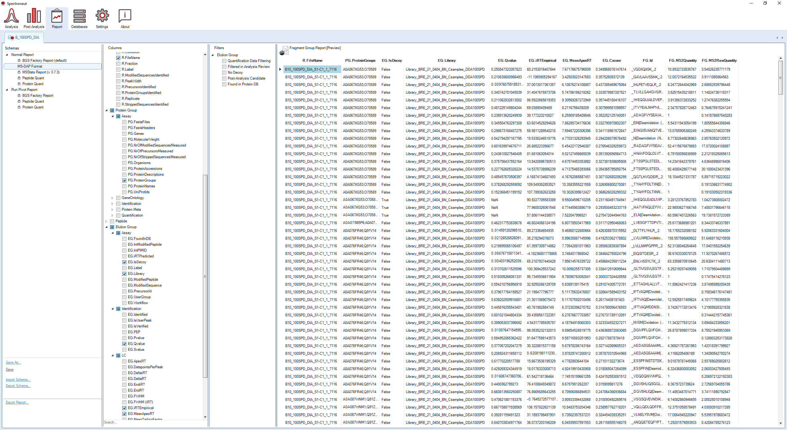
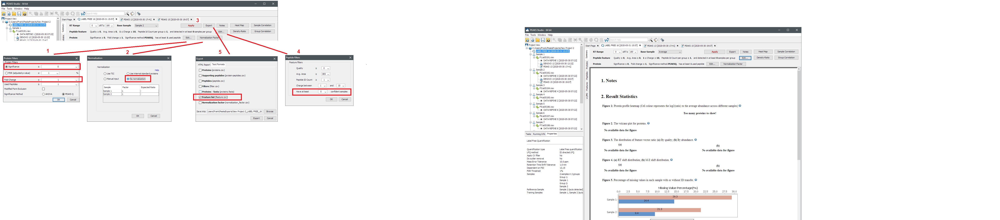

-   [Annotated example](#annotated-example)
    -   [Import data](#import-data)
    -   [Sample metadata table](#sample-metadata-table)
    -   [Define contrasts](#define-contrasts)
        -   [Dealing with batch effects](#dealing-with-batch-effects)
    -   [Apply pipeline](#apply-pipeline)
    -   [visualize all peptide-level data per
        protein](#visualize-all-peptide-level-data-per-protein)
-   [Preparing input data](#preparing-input-data)
    -   [MaxQuant](#maxquant)
    -   [MetaMorpheus](#metamorpheus)
    -   [Skyline](#skyline)
    -   [FragPipe](#fragpipe)
    -   [DIA-NN](#dia-nn)
    -   [OpenSWATH](#openswath)
    -   [EncyclopeDIA](#encyclopedia)
    -   [Spectronaut](#spectronaut)
    -   [Peaks](#peaks)
    -   [OpenMS](#openms)
    -   [ProteomeDiscoverer](#proteomediscoverer)

This vignette describes the main functions of the MS-DAP R package.

If you have not installed MS-DAP yet, check out the installation guides
and example dataset for. You can use either of these;

1.  [MS-DAP in a Docker container](docker.md) that includes everything
    required to get started right away
2.  [MS-DAP R package](rpackage.md) that may be installed into a
    preexisting bioinformatics workflow

# Annotated example

The main steps in MS-DAP analyses are:

1.  prepare data
    -   import files from MaxQuant/Skyline/Spectronaut/etc.
    -   import fasta files
    -   import sample metadata
    -   define contrasts
2.  run pipeline
3.  inspect QC report
4.  optionally, adjust settings and re-run

## Import data

Below R snippets describe a typical workflow that can be used as a
template for analyzing your datasets.

Don’t forget to update file paths, and make sure to use forward slashes
(instead of backslashes) to denote the full paths.

``` r
library(msdap)

# this example imports a DDA dataset from metamorpheus.
# See above sections for appropriate commands to import data from other upstream software
dataset = import_dataset_metamorpheus(
  path = "C:/<path>/Task2-SearchTask", 
  # proteins with a lower Q-value than this threshold are removed
  protein_qval_threshold = 0.05, 
  # if you instead want to collapse precursors at the plain sequence level, use: collapse_peptide_by = "sequence_plain"
  collapse_peptide_by = "sequence_modified"
)

# this should be the exact same fasta files used to generate the above input data!
dataset = import_fasta(
  dataset, 
  files = c("C:/<path>/fasta/UniProt_2018-05/UP000000589_10090.fasta", 
            "C:/<path>/fasta/UniProt_2018-05/UP000000589_10090_additional.fasta")
)

# optionally, remove proteins (and their respective peptides) from the dataset that match some user filters 
# * recommend to skip this step while initially testing MS-DAP, this is not required *
# 
# in this example, we apply a regular expression to the fasta header of each protein to remove IGGs and keratins (useful for IP experiments)
# in DIA experiments, you may also want to auto-detect and remove the IRT peptides, provided the IRT fasta file was used while creating the spectral library and the fasta header forthe irt protein matches the built-in regex filter (case insensitive); |IRT| OR |IRT_KIT| OR "Biognosys iRT"
# finally, one can remove known contaminants by providing an array of gene symbols (which are also matched to fasta headers)
# note; the set of removed/filtered proteins is immediately shown in the R console
dataset = remove_proteins_by_name(
  dataset, 
  # writing regular expressions can be daunting, either leave out this parameter or ask your local bioinformatician for help on complex queries
  regular_expression = "ig \\S+ chain|keratin|GN=(krt|try|igk|igg|igkv|ighv|ighg)",
  remove_irt_peptides = FALSE,
  gene_symbols = c("gene1", "othergenesymbol")
)
```

**optionally updating peptide-to-protein mappings**

*This experimental feature is optional and still in development.
Recommend to skip this step while initially testing MS-DAP. Only
MaxQuant searches can be used to update the protein_id assigned to each
peptide in a dataset for now.*

In some situations, you may want to update/override the
peptide-to-protein mappings in a dataset. For example in Spectronaut DIA
analyses: when using a MaxQuant search as input for a Spectronaut
spectral library the razor-peptide assignments are lost and peptides are
instead assigned to all respective protein groups. If you would rather
use the peptide-to-protein mapping exactly as intially inferred by
MaxQuant, use the code snippet below.

example code snippet;

``` r
dataset = import_dataset_spectronaut("C:/data/experiment1/spectronaut_output/report.xls")
dataset = update_protein_mapping_from_maxquant(dataset, path_maxquant = "C:/data/experiment1/maxquant_output/txt", remove_shared = TRUE)
```

## Sample metadata table

The sample metadata table describes all samples in your dataset.

Workflow:

1.  after initially loading a dataset, create a sample metadata template
2.  edit the template in Excel or LibreOffice Calc
    -   specify the group/condition of each sample in the ‘group’ column
    -   indicate which samples are outliers by setting ‘exclude’ entries
        to TRUE
    -   add additional columns with any metadata, that describe the
        sample batch, gel, etc.

<!-- -->

3.  save the Excel file and import the sample metadata in R

``` r
# create a template file to describe your sample metadata
write_template_for_sample_metadata(dataset, "C:/<path>/samples.xlsx", overwrite = FALSE)

# ! edit this sample metadata table in Excel/LibreOffice Calc !

# finally, import your updated sample metadata file
dataset = import_sample_metadata(dataset, "C:/<path>/samples.xlsx")
```

Note that QC figures are automatically generated for all provided sample
metadata! Numeric values are color-coded on a continuous scale (eg; from
light to dark) while non-numeric values are considered discrete values
and color-coded using diverging colors. We encourage users to describe
experimental circumstances relevant for potential batch effects, as
further described in the introduction vignette.

## Define contrasts

Optionally, define contrasts that specify which sample groups you want
to compare. If none are provided, differential expression analysis is
skipped. So you can make QC reports and completely skip DEA.

format: a list of lists, where each item must be a sample group defined
in your sample metadata table.

typical wild-type *vs* knockout;

``` r
dataset = setup_contrasts(dataset, contrast_list = list(c("WT", "KO")))
```

A more elaborate example that shows how to define multiple contrasts and
define contrasts containing multiple groups;

``` r
dataset = setup_contrasts(dataset, 
                          contrast_list = list(
                            # control vs cond1
                            c("control", "cond1"),
                            # control vs cond1,cond2 (eg; we here combine 2 sample groups on the right-hand side of this contrast)
                            list(c("control"), c("cond1", "cond2")),
                            # control,rescue vs cond1,cond2
                            list(c("control", "rescue"), c("cond1", "cond2"))
                          ))

# technical note: be mindful of brackets and commas when making these nested structures!
# technical note: each element in a list must be separated by a comma
```

### Dealing with batch effects

For DEA algorithms that apply a linear regression (e.g. MSqRob, eBayes,
DEqMS. But *not* MS-EmpiRe), you can easily add a random variable to the
regression model to account for batch effects.

These need to be defined when setting up your statistical contrasts
using the `random_variables` parameter. Example code:

``` r
dataset = setup_contrasts(dataset, 
                          contrast_list = list(c("control", "phenotype")),
                          random_variables = "cohort")
```

## Apply pipeline

``` r
dataset = analysis_quickstart(
  dataset,
  ## peptide filter criteria applied to replicate samples within a sample group
  # You only have to provide active filters (but specify at least 1)
  # respective params; filter_min_detect, filter_fraction_detect, filter_min_quant, filter_fraction_quant
  #
  # recommended settings, DDA: no filter on minimum number of detect (MS/MS IDs) and quantified in at least N=3 and 75% of replicates
  # recommended settings, DIA: set the 'detect' settings to same values as 'quant'; filter_min_detect=3, filter_fraction_detect=0.75
  filter_min_detect = 0,
  filter_min_quant = 3,
  filter_fraction_detect = 0,
  filter_fraction_quant = 0.75,
  ## filter criteria on protein level
  filter_topn_peptides = 0, # set to 0 to disable topN filtering. if enabled, a typical setting would be between 5, 10 or 15
  filter_min_peptide_per_prot = 1,

  ## two distinct approaches to selecting peptides can be used for downstream statistical analysis: 1) 'within contrast' and 2) 'apply filter to all sample groups'
  # 1) determine within each contrast (eg; group A vs group B) what peptides can be used by applying above peptide filter criteria and then apply normalization to this data subset
  # advantaguous in datasets with many groups; this maximizes the number of peptides used in each contrast (eg; let peptide p be observed in groups A and B, not in C. we'd want to use it in A vs B, not in A vs C)
  # as a disadvantage, this complicates interpretation since the exact data used is different in each contrast (slightly different peptides and normalization in each contrast)
  #
  # 2) apply above filter criteria to each sample group (eg; a peptide must past these filter rules in every sample group) and then apply normalization
  # this data matrix is then used for all downstream statistics
  # advantage; simple and robust
  # disadvantage; potentially miss out on (group-specific) peptides/data-points that may fail filter criteria in just 1 group, particularly in large datasets with 4+ groups
  # set filter_by_contrast = FALSE for this option
  # 
  # note; if there are just 2 sample groups (eg; WT vs KO), this point is moot as both approaches are the same
  filter_by_contrast = TRUE,

  ## normalization algorithms are applied to the peptide-level data matrix.
  # options: "" (empty string disables normalization), "vsn", "loess", "rlr", "msempire", "vwmb", "modebetween", "modebetween_protein" (this balances foldchanged between sample groups. Highly recommended, see MS-DAP manuscript)
  #
  # You can combine normalizations by providing an array of options to apply subsequential normalizations.
  # For instance, \code{norm_algorithm = c("vsn", "modebetween_protein")} applies the vsn algorithm (quite strong normalization reducing variation) and then balances between-group protein-level foldchanges with modebetween normalization.
  #
  # Benchmarks have shown that c("vwmb", "modebetween_protein") and c("vsn", "modebetween_protein") are the optimal strategies, see MS-DAP manuscript.
  norm_algorithm = c("vwmb", "modebetween_protein"),

  ## Differential Expression Analysis (DEA)
  # algorithms for differential expression analysis. options: options: ebayes, deqms, msempire, msqrob, msqrobsum
  # You can simply apply multiple DEA models in parallel by supplying an array of options. The output of each model will be visualized in the PDF report and data included in the output Excel report.
  dea_algorithm = c("deqms", "msempire", "msqrob"),
  # significance cutoff used in QC plots and 'significant' column in output Excel tables
  dea_qvalue_threshold = 0.05,
  # threshold for significance of log2 foldchanges. Set to zero to disregard or a positive value to apply a cutoff to absolute log2 foldchanges. MS-DAP can also perform a bootstrap analyses to infer a reasonable threshold by setting this parameter to NA
  dea_log2foldchange_threshold = NA,

  ## for differential detection only; minimum number of samples where a protein should be observed at least once by any of its peptides (in either group) when comparing a contrast of group A vs B
  diffdetect_min_samples_observed = 3,

  ## Quality Control reports
  # whether to create the Quality Control report. options: FALSE, TRUE . Highly recommended to set to TRUE (default). Set to FALSE to skip the report PDF (eg; to only do differential expression analysis and skip the time-consuming report creation)
  output_qc_report = TRUE,
  # whether to write protein-level data matrices to file. options: FALSE, TRUE
  output_abundance_tables = TRUE,
  # output directory where all output files should be stored. If not an existing directory, it will be created
  output_dir = "C:/<path>/",
  # optionally, automatically create a subdirectory (within output_dir) that has the current date&time as name and store results there
  output_within_timestamped_subdirectory = TRUE,
  # if you're interested in performing custom bioinformatic analyses and want to use any of the data generated by this tool, you can dump all intermediate files to disk. Has performance impact so don't enable by default. options: FALSE, TRUE
  dump_all_data = FALSE
)

## optionally, print a summary. 
# Very convenient when quickly iterating/exploring various DEA settings. For example:
# a) disable all output files to speed things up (output_qc_report=FALSE, output_abundance_tables=FALSE)
# b) use only ebayes for DEA to speed things up (dea_algorithm = "ebayes"). note; we mostly use; dea_algorithm = c("ebayes", "msempire", "msqrob")
# c) change parameters (eg; filtering rules/normalization/signif or foldchange threshold) -->> run pipeline -->> print summary -->> iterate again
print_dataset_summary(dataset)
```

## visualize all peptide-level data per protein

This is relatively time consuming, especially when you select to print
*all* proteins in the dataset. We therefore suggest to create these
figures after exploring filtering, normalization and DEA parameters (and
their impact on QC figures and finding significant hits).

Importantly, the `norm_algorithm` parameter should list the same
algorithm(s) as used in the pipeline previously

``` r
plot_peptide_data(dataset, select_all_proteins = FALSE, select_diffdetect_candidates = TRUE, select_dea_signif = TRUE, output_dir = "C:/<path>/", 
                  # do you want to visualize peptide*sample data points that did not pass the filtering criteria for DEA ?
                  show_unused_datapoints = TRUE, 
                  # importantly, sync this parameter with the setting you used for analysis_quickstart()
                  norm_algorithm = c("vwmb", "modebetween_protein"))
```

# Preparing input data

Instructions specific to each of the supported input software (eg;
MaxQuant, Skyline, etc.) are described in this section.

## MaxQuant

No particular settings are needed, MS-DAP can use the output as-is
(assuming the analyzed dataset was label-free). As input for MS-DAP, the
MaxQuant ‘txt’ output folder is required (typically nested somewhere in
your raw data folder).

If you want to save on diskspace, this is the minimum set of input files
needed: evidence.txt, peptides.txt, proteinGroups.txt (but make sure to
always backup the parameters.txt/mqpar.xml and summary.txt files as
well, to document your configuration and result summary).

MS-DAP import function: `msdap::import_dataset_maxquant_evidencetxt()`  
Example;
`dataset = import_dataset_maxquant_evidencetxt("C:/DATA/project_x/sample1/combined/txt")`

## MetaMorpheus

If you enable label-free quantification in a MetaMorpheus search, the
output is compatible with MS-DAP. As input for MS-DAP, the output folder
that contains search results is required (the one that contains
AllProteinGroups.tsv, among others).

If you want to save on diskspace, this is the minimum set of input files
needed: AllProteinGroups.tsv and AllQuantifiedPeaks.tsv (but make sure
to always backup the allResults.txt file and “Task Settings” folders as
well, to document your configuration and result summary).

MS-DAP import function: `msdap::import_dataset_metamorpheus()`  
example;
`dataset = import_dataset_metamorpheus("C:/DATA/PXD007683/2019-10-14-19-20-46/Task2-SearchTask")`

## Skyline

For both DDA and DIA datasets, a report with peptide abundances should
be prepared that contains these columns: FileName, ProteinName,
ModifiedSequence, PrecursorCharge, BestRetentionTime, TotalArea,
annotation_QValue

Preferably make a report with only target peptides, but if there are
decoys in the dataset there should also be a column named “IsDecoy”
(without quotes) that indicates decoys as ‘decoy’, 1 or ‘true’

Since Skyline supports both DDA and DIA data, you will need to specify
of which type your data is when importing a dataset.

MS-DAP import function: `msdap::import_dataset_skyline()`

## FragPipe

To generate output files that required for MS-DAP, use FragPipe for
label-free quantification (MS1) as follows:

-   assign Experiment IDs in the workflow tab (optionally you may simply
    set these all to 1). Replicate can be empty
-   enable IonQuant in the “Quant (MS1)” tab
-   optionally, enable match-between-runs

MS-DAP import function: `msdap::import_dataset_fragpipe_ionquant()`
combines data from the MSstats.csv file and various other FragPipe
output files into a MS-DAP dataset.

Alternatively, you can directly import a psm.tsv file generated through
FragPipe workflows into MS-DAP using the
`msdap::import_dataset_fragpipe_psm_file()` function (niche use-case,
most users will want to follow above workflow).

## DIA-NN

No particular settings are needed, MS-DAP can use the output as-is.

MS-DAP import function: `msdap::import_dataset_diann()`

## OpenSWATH

No particular settings are needed, MS-DAP can use the output as-is.

MS-DAP import function: `msdap::import_dataset_openswath()`

## EncyclopeDIA

No particular settings are needed. MS-DAP can import peptide
intensities, retention times and peptide-to-protein mappings from a
‘Quant Report’ .elib file generated by EncyclopeDIA.

Because an EncyclopeDIA ‘Quant Report’ does not contain confidence
scores per peptide per individual sample, these can optionally be
imported from the individual .elib files generated by EncyclopeDIA while
processing the individual samples / raw files. This will enable MS-DAP
to discriminate between match-between-runs hits and peptides that were
detected/identified in a sample, and consequently use this information
in peptide filtering (for instance by removing peptides that are mostly
based on MBR hits).

MS-DAP import function: `msdap::import_dataset_encyclopedia()`

## Spectronaut

A custom report schema should be created to export Spectronaut data into
a format compatible with MS-DAP.

There’s 2 ways to set this up (you only have to do this once):

1.  download and import a schema that we already prepared for you
    (probably easiest)

-   <a id="raw-url" href="https://raw.githubusercontent.com/ftwkoopmans/msdap/master/doc/misc/MS-DAP%20Format.rs">download
    the report schema</a>
-   in Spectronaut, open your dataset and go to the Report section
-   click “import Schema…” then select the file you just downloaded

2.  manually create a new schema

-   in Spectronaut, open your dataset and go to the Report section
-   click the default report
-   select/checkbox these columns (you can uncheck everything else to
    keep your report file small): R.FileName, PG.ProteinGroups,
    EG.IsDecoy, EG.Library, EG.Cscore, EG.Qvalue, EG.iRTEmpirical,
    EG.MeanApexRT (or EG.RTEmpirical if you’re on an old version),
    FG.Id, FG.MS2Quantity (or FG.MS2PeakArea / FG.TotalPeakArea if
    you’re on an old version), FG.MS2RawQuantity (or
    FG.NormalizedMS2PeakArea / FG.NormalizedTotalPeakArea if you’re on
    an old version)
-   unselect all filters (i.e. don’t remove any peptide and keep decoys
    in the output)
-   click “Save as…” to save your new report schema (e.g. with name
    “MS-DAP Format”)

Now that the report schema is setup, select the “MS-DAP Format” schema
and click “Export Report…” to create an input file for MS-DAP.

The column names in Spectronaut reports have changed between versions,
we implemented and tested backward compatibility up to Spectronaut 6.

MS-DAP import function: `msdap::import_dataset_spectronaut()`

The screenshot below shows the “MS-DAP Format” schema, with the data
preview (right-hand side) confirming all required columns have been
selected. If the image is too small to read the text; right-click and
select “open image in new tab” (or just right-click, download/save
image, open the downloaded image)

<figure>
<figcaption aria-hidden="true">Spectronaut config</figcaption>
</figure>

## Peaks

*Support is experimental, additional user testing and test datasets are
most welcome. Our lab doesn’t have a Peaks licences, so if you have a
suitable label-free test dataset to contribute please contact us*.

After performing label-free quantification, make sure to disable **all**
filtering and export the features.

Do note that this data table does not contain the confidence scores for
each peptide in each sample, thus we cannot discriminate between
peptides ‘identified and quantified’ versus ‘only quantified’
(match-between-runs) downstream. Consequently, in datasets imported from
Peaks all peptides are considered ‘identified & quantified’.

<figure>
<figcaption aria-hidden="true">Peaks config</figcaption>
</figure>

MS-DAP import function: `msdap::import_dataset_peaks()`

## OpenMS

*Support is experimental, we are currently extending the OpenMS
workflows supported by MS-DAP. Additional user testing and test datasets
are most welcome*.

For now, label-free DDA data processed by OpenMS are only compatible
with MS-DAP if a workflow was used analogous to the tutorial by Hannes
Rost @
<https://abibuilder.informatik.uni-tuebingen.de/archive/openms/Tutorials/Data/iPRG2015_Hannes/>

To make it easier for MS-DAP users to get started with a compatible
OpenMS workflow, and construct a standardized script for integrated
testing of OpenMS + MS-DAP, we created a .bat script for Windows
computers that performs the suggested workflow, available for download
here: -
[openms_lfq_workflow_v0.2.bat](misc/openms_lfq_workflow_v0.2.bat)

input: mzML and fasta files. output: mzTab file compatible with MS-DAP

*Windows .bat script explained* This script applies an OpenMS workflow
for label-free data analysis to all mzML files in the same directory
using the fasta files on the same location. workflow is the same as the
iPRG2015 OpenMS tutorial by Hannes Rost

requirements:

-   OpenMS 2 (our test system runs version 2.5)
-   MSGFPlus installed as OpenMS thirdparty plugin
-   Percolator installed as OpenMS thirdparty plugin
-   java runtime is required for MSGFPlus, you probably have this but in
    case of problems/errors with MSGFPlus grab latest version from
    www.java.com
-   after installation of the above, you may need to reboot first as we
    found on some test systems

1.  place this .bat file in the directory where your input files are
2.  input: centroided mzML files + fasta files WITHOUT decoys (will be
    generated on-the-fly)
3.  output: mzTab output file compatible with MS-DAP + consensusXML for
    (optional) further processing by OpenMS

MS-DAP import function: `msdap::import_dataset_openms_mztab()`

## ProteomeDiscoverer

*Support is experimental, we have tested some PD workflows. Additional
user testing and test datasets are most welcome. Our lab doesn’t have a
PD licence, so if you have suitable label-free test dataset to
contribute please contact us*.

Input data must contain Percolator PEP scores for each PSM, so after the
search engine node (eg; Sequest HT) make sure to connect the Percolator
node.

As input for MS-DAP, the PSMs.txt file from a PD label-free
quantification workflow is used.

Example PD workflow:

-   Processing Step: PWF_QE_Precursor_Quan_and_LFQ_SequestHT_Percolator
-   Consensus Step: CWF_Comprehensive_Enhanced
    Annotation_LFQ_and_Precursor_Quan
-   Consensus Step: add the “result exporter” (drag&drop from side panel
    to bottom panel)

Optionally, tweak label-free data analysis settings to explore effects
on MS-DAP assessment of your dataset:

-   Consensus step –>\> “peptide and protein filter” –>\> Peptide
    Confidence At Least –>\> change to medium
-   Processing Step –>\> change precursor quantification from peak
    (height) to area

MS-DAP was tested with the results of the above workflow applied to the
PXD007683 dataset.

MS-DAP import function: `msdap::import_dataset_proteomediscoverer_txt()`
